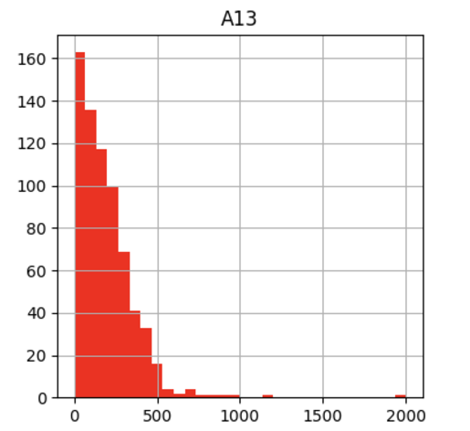
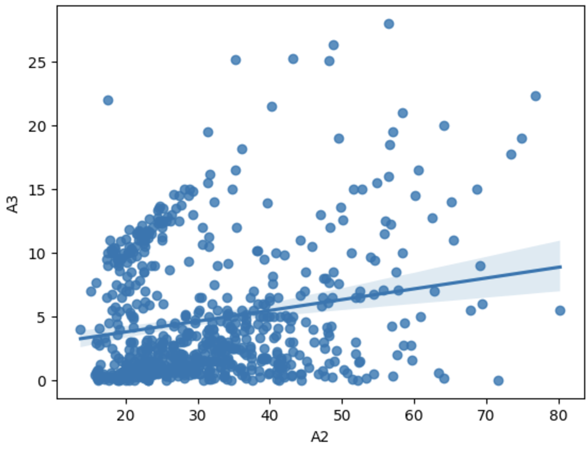

# Behavioral Fraud Analytics

## Objective
This project leverages unsupervised and supervised learning to create a model that identifies fraudulent applications. The objective is to identify fraudulent credit card applications using a combination of Self-Organizing Maps - SOM to detect anomalies and Artificial Neural Networks - ANN to classify frauds accurately.

---

## Dataset
### **File Name**:  
`credit_Card_applications.csv`  

### **Dataset Structure**:  
- **Features**:  
  - `customer_id`: Unique identifier for each applicant  
  - `A1` to `A14`: Attributes describing applicant details  
  - `class`: Target variable  
    - `0`: Credit card not approved  
    - `1`: Credit card approved  

### Dataset Characteristics:
- `A3` and `A7`: Most values lie between 0 to 5.
- 
-  
- `A2`: Right-skewed and normally distributed with values between 10 and 80.
-  
- `A13`: Most values are concentrated at 0, with values ranging up to 1000.
-  
- `A12`: Nominal attribute with values {1, 2, 3}.
-  
- `A8`: Binary attribute with a positive linear relationship with `class`.  

---

## Libraries Used
- `pandas`  
- `numpy`  
- `matplotlib`  

---

## Exploratory Data Analysis
1. **Key Observations**:
   - Strong positive linear relationship between `A8` and `class` — applications with `A8 = 1` tend to get approved.
   -  
   - `A2` and `A3` show a positive linear relationship.
   -  
2. **Outliers**:
   - Outliers were not removed since they are critical for identifying fraudulent patterns.  
3. **Correlation Analysis**:
   - Heatmap highlights a strong correlation between `A8` and `class`, making `A8` a key feature in determining approvals.
   -  

---

## Data Preprocessing
1. **Handling Missing Values**:  
   - Replaced missing values in attributes with the mean using `SimpleImputer`.  
2. **Feature Scaling**:  
   - Applied `StandardScaler` to scale numerical columns between 0 and 1.  
   - Essential for both SOM and ANN to ensure feature uniformity.  

---

## Model Building

### **Step 1: Self-Organizing Map (SOM)**

#### SOM Configuration:
- **Grid Dimensions**: 10 x 10  
- **Sigma**: 0.1  
- **Learning Rate**: 0.5  

#### Fraud Detection:
1. **Distance Mapping**:  
   - Used `som.distance_map()` to calculate the mean Euclidean distance of each node to its neighbors.
   -  
2. **Best Matching Unit (BMU)**:  
   - Used `som.winner(x)` to identify the closest grid cell for each data point.  
3. **Fraud Probability Threshold**:  
   - Set a threshold of 0.8, identifying 37 fraudulent applications.  
4. **Reverse Mapping**:  
   - Reverse-mapped grid blocks to customer IDs for fraud identification.  

---

### **Step 2: Artificial Neural Network (ANN)**

#### Input Data:
- Augmented dataset with the target variable `is_fraud`, based on SOM predictions.  

#### ANN Architecture:
- **Input Layer**: 15 neurons, activation function = ReLU  
- **Hidden Layer**: 7 neurons, activation function = ReLU  
- **Output Layer**: 1 neuron, activation function = Sigmoid  

#### Hyperparameters:
- Optimizer: `adam`  
- Loss Function: `binary_crossentropy`  
- Metrics: `accuracy`  
- Batch Size: 1  
- Epochs: 10  

#### Results:
- Final Accuracy: **99.35%**  
- Final Loss: **0.0482**  

---

## Future Scope
1. **Dynamic Fraud Detection**: Incorporate real-time detection of fraudulent applications.  
2. **Feature Engineering**: Explore additional features or external datasets for enhanced accuracy.  
3. **Model Optimization**: Implement advanced architectures like Convolutional or Recurrent Neural Networks for better feature extraction.  
4. **Explainability**: Add interpretable models to understand the decision-making process.  

---

## How to Run

### **Pre-requisites**:
1. Install the required libraries:
   ```bash
   pip install pandas numpy matplotlib

---

## Conclusion
- The SOM effectively identified fraudulent applications by clustering anomalies.  
- The ANN further refined the fraud detection process, developing a model achieving a high accuracy of 99.35%.
- This model can be further trained with transfer learning to be applied to niche areas of fraud identification 

